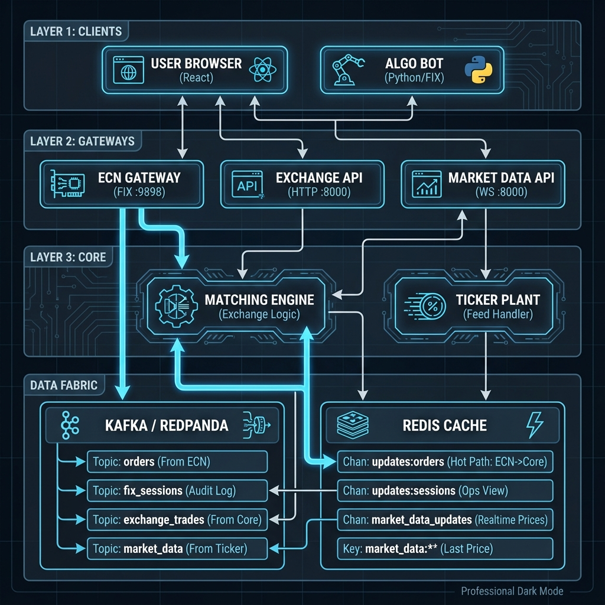
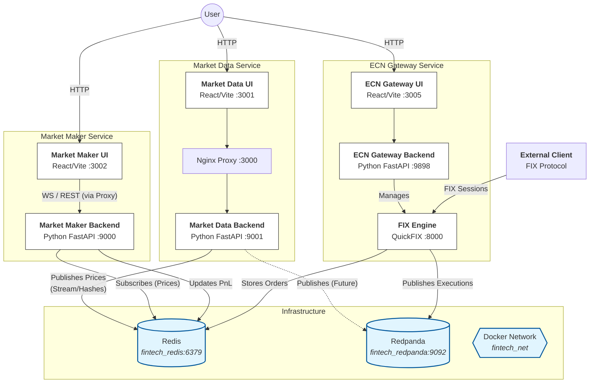

# Architecture Overview

This document illustrates the high-level architecture of the Trading Server, composed of three main microservices: **Market Data**, **Market Maker**, and **ECN Gateway**, running on a shared infrastructure.

## System Diagram

## Layered Description

### 1. Presentation Layer (Frontend)
Each service has its own dedicated React-based UI, served via Vite or Nginx.
- **Market Data UI** (`:3000/3001`): Displays monitoring of data streams.
- **Market Maker UI** (`:3002`): Interactive blotter for managing positions and viewing PnL.
- **ECN Gateway UI** (`:3005`): Administrative dashboard for managing the exchange simulator and orders.

### 2. Application Layer (Backend)
Python-based microservices handling business logic.
- **Market Data Backend**: Fetches external data (Polygon/Simulated) and normalizes it.
- **Market Maker Backend**: Manages proprietary inventory/positions and calculates real-time PnL based on market moves.
- **ECN Gateway Backend**: Orchestrates the Exchange Simulator.

### 3. Connectivity Layer
- **FIX Engine (QuickFIX)**: Embedded within the ECN Gateway, handling standard financial information exchange (FIX) protocol messages (Orders, Executions) from external clients.

### 4. Data & Messaging Layer (Infrastructure)
Shared services running in the `fintech_net` network.
- **Redis (`fintech_redis`)**:
  - **Real-time Cache**: Stores latest prices (`market_data:{ticker}`).
  - **Message Broker**: PubSub for real-time price updates to Market Maker (`market_data_updates`).
  - **State Store**: Persists order books and positions.
- **Redpanda (`fintech_redpanda`)**:
  - **Event Streaming**: Future-proof log for trade reporting and audit trails.
