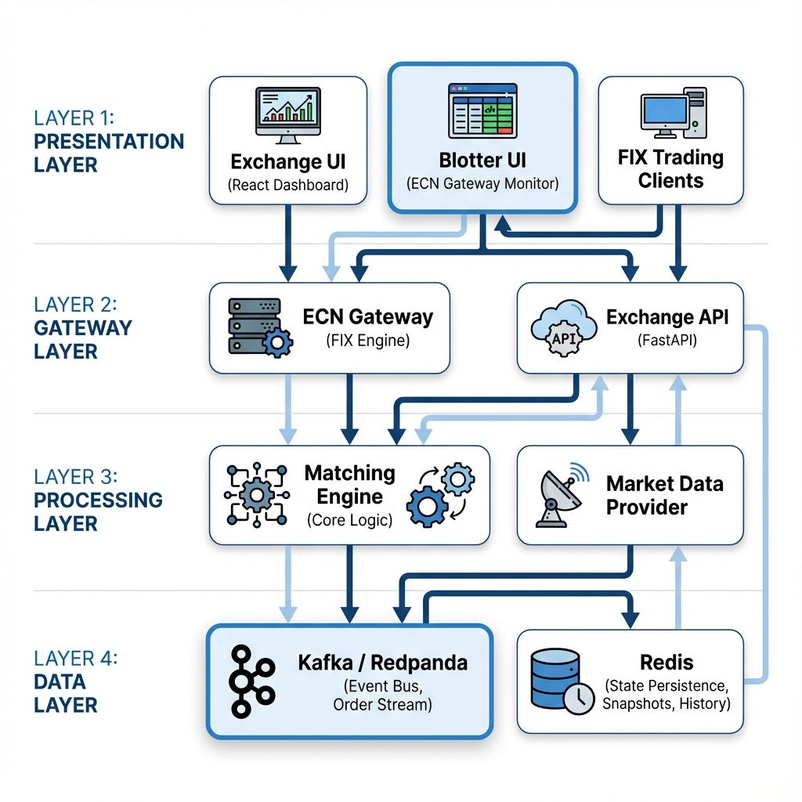

# Trading Server Architecture




```mermaid
graph TD
    subgraph Presentation ["Presentation Layer"]
        UI[Exchange UI (React)]
        Blotter[ECN Gateway UI (Blotter)]
        Client[FIX Clients (Algos/Traders)]
    end

    subgraph Gateway ["Gateway Layer"]
        API[Exchange API (FastAPI)]
        ECN[ECN Gateway (FIX Engine)]
    end

    subgraph Processing ["Processing Layer"]
        ME[Matching Engine]
        MDP[Market Data Provider]
    end

    subgraph Data ["Data & Persistence Layer"]
        Redis[(Redis: State & History)]
        Kafka{Kafka/Redpanda: Event Bus}
    end

    %% Flows
    Client -- "FIX 4.2" --> ECN
    Blotter -- "HTTP/WS" --> ECN
    
    ECN -- "Publish Orders" --> Kafka
    Kafka -- "Order Stream" --> ME
    
    ME -- "Match & Execute" --> ME
    ME -- "Publish Executions" --> Kafka
    ME -- "Persist State" --> Redis
    
    MDP -- "Updates" --> Kafka
    
    Kafka -- "Real-time Events" --> API
    Redis -- "Snapshots/History" --> API
    
    API -- "WebSocket / REST" --> UI
    
    %% Styling
    classDef layer fill:#f9f9f9,stroke:#333,stroke-width:2px;
    class Presentation,Gateway,Processing,Data layer;
```

## Component Details

### Presentation Layer
*   **Exchange UI**: React application displaying real-time market data. Components include:
    *   **MarketWidget**: Composite widget with Order Book, Trade Feed, and Price Chart.
    *   **Dashboard**: Manages layouts and backend connections.
*   **FIX Clients**: External algorithms or traders connecting via standard FIX protocol.

### Gateway Layer
*   **ECN Gateway**: Validates and transforms FIX messages into internal JSON format for the engine.
*   **Exchange API**: Serves the UI.
    *   **REST**: `/snapshot/{symbol}`, `/reset`, `/tickers`.
    *   **WebSocket**: Broadcasts `EXECUTION_REPORT` and `MARKET_DATA` updates.

### Processing Layer
*   **Matching Engine**: Core logic. Matches buy/sell orders, manages Order Books, handles trade execution.
    *   **New**: Supports `reset()` to clear state.
*   **Market Data Provider**: Fetches external reference data (e.g., Yahoo Finance) for pricing context.

### Data Layer (Redis)
*   **Order Stream**: `updates:orders` - Queue for decoupling Gateway and Engine.
*   **Pub/Sub**: `updates:orders`, `market_data_updates` - Real-time notification bus.
*   **State & History**:
    *   `exchange:snapshot:{symbol}`: Current Order Book state.
    *   `exchange:trades:{symbol}`: List of last 100 historical trades.
    *   `market_data:{symbol}`: Last traded price/volume.
